<div align="center">

# Overworld

**Map Habitica tasks by zone and archive what it deletes**

[![Live][badge-site]][url-site]
[![HTML5][badge-html]][url-html]
[![CSS3][badge-css]][url-css]
[![JavaScript][badge-js]][url-js]
[![Python][badge-py]][url-py]
[![Claude Code][badge-claude]][url-claude]
[![License][badge-license]](LICENSE)

</div>

## Overview

Habitica is good at capture and quietly bad at memory. It **hard-deletes completed
to-dos after 30 days** and averages daily history into monthly points after 60, so
the question "what did I actually get done this quarter" has no answer inside the
app. Overworld archives that data before it disappears, then shows the account two
ways Habitica cannot: as a board of open missions filtered by where you physically
are, and as metrics built on history that survived.

Your credentials stay in your browser and go to one host, `habitica.com`. There is
no backend.

**Live:** [overworld.neorgon.com](https://overworld.neorgon.com/)

## Features

**Missions** -- a zone board. Pick where you are and see what is reachable from
there, or scan every zone to find out what opens up if you go somewhere.

**Capture** -- one field. `buy coffee filters @errand ?buy !week` becomes a to-do
with three tags, so it stays organised in the Habitica app and the phone widget too.

**Dashboard** -- completions per day, streaks, zone breakdown, level and gold. Today
comes from Habitica, history comes from the local archive.

**Hygiene** -- untagged tasks, to-dos with no due date, dead daily streaks, orphan
tags, and facet coverage across the account.

**Archive** -- an append-only local store, importable and exportable as one file,
shared with the CLI.

**`hbx`** -- a standard-library Python CLI that snapshots the account on a schedule,
proposes a tag taxonomy without applying it, and exports JSON, CSV or Markdown for
other tools.

## The tag grammar

Habitica has no location field and no custom fields, so every dimension lives in a
tag name. Four facets, each a sigil prefix:

| Facet | Sigil | Answers | Example |
|---|---|---|---|
| Zone | `@` | Where can this be done | `@errand` |
| Area | `+` | Which life is this | `+work` |
| Horizon | `!` | When does it matter | `!now` |
| Kind | `?` | What shape of action | `?buy` |

The sigil is load-bearing: Habitica's tag list is flat and alphabetical, so a
leading sigil clusters each facet together inside the mobile app, where capture
actually happens. Full rules in [`docs/tag-grammar.md`](docs/tag-grammar.md).

## Running locally

```bash
make serve          # http://localhost:8864
```

ES modules need an HTTP server; opening `index.html` over `file://` will not work.

The CLI needs both Habitica credentials, from Settings then Site Data then API:

```bash
export HABITICA_USER_ID=...
export HABITICA_API_TOKEN=...

python3 tools/hbx.py snapshot      # pull and archive
python3 tools/hbx.py analyze       # tag landscape and hygiene
python3 tools/hbx.py plan -o plan.json
python3 tools/hbx.py apply --plan plan.json          # preview, offline
python3 tools/hbx.py apply --plan plan.json --apply  # write
```

Tests:

```bash
python3 tools/test_hbx.py        # 25 tests
node --test tools/test_site.mjs  # 12 tests
```

## Architecture



```
overworld-site/
├── index.html              # App shell, SEO head, and the CSP that pins connect-src
├── css/
│   └── style.css           # Site styles; tokens come from the CDN base.css
├── js/
│   ├── app.js              # Entry point, 23 lines
│   ├── state.js            # App state; credentials kept OUTSIDE it deliberately
│   ├── habitica.js         # API client and the shared 30/minute rate limiter
│   ├── archive.js          # IndexedDB archive, bundle import and export
│   ├── grammar.js          # Sigil parsing; mirror of tools/hbxlib/grammar.py
│   ├── data.js             # Pull orchestration and the pure selectors
│   ├── render.js           # Shell chrome and view dispatch
│   ├── events.js           # Delegated event handling, no inline onclick
│   └── views/              # connect, missions, capture, dashboard, hygiene, archive
├── tools/
│   ├── hbx.py              # CLI entry point
│   ├── hbxlib/             # config, api, archive, grammar, analyze, plans, exports, reminders
│   ├── test_hbx.py         # CLI tests
│   ├── test_site.mjs       # Browser-free site-module tests
│   └── com.neorgon.overworld.snapshot.plist   # Daily snapshot via launchd
└── docs/
    └── tag-grammar.md      # The facet contract shared by the site and the CLI
```

## Why no backend

Habitica's API returns `access-control-allow-origin: *` and accepts
`x-api-user` / `x-api-key` from a browser, so the page talks to it directly. A
Convex backend or a Worker proxy would add a hop and one more place a personal
API token rests, and would buy only unattended snapshots, which the launchd job
already does locally.

<div align="center">

Part of [Neorgon](https://neorgon.com/)

</div>

[badge-site]:    https://img.shields.io/badge/live_site-0063e5?style=for-the-badge&logo=googlechrome&logoColor=white
[badge-html]:    https://img.shields.io/badge/HTML5-E34F26?style=for-the-badge&logo=html5&logoColor=white
[badge-css]:     https://img.shields.io/badge/CSS3-1572B6?style=for-the-badge&logo=css3&logoColor=white
[badge-js]:      https://img.shields.io/badge/JavaScript-F7DF1E?style=for-the-badge&logo=javascript&logoColor=black
[badge-py]:      https://img.shields.io/badge/Python-3776AB?style=for-the-badge&logo=python&logoColor=white
[badge-claude]:  https://img.shields.io/badge/Claude_Code-CC785C?style=for-the-badge&logo=anthropic&logoColor=white
[badge-license]: https://img.shields.io/badge/license-MIT-404040?style=for-the-badge

[url-site]:   https://overworld.neorgon.com/
[url-html]:   #
[url-css]:    #
[url-js]:     #
[url-py]:     #
[url-claude]: https://claude.ai/code
